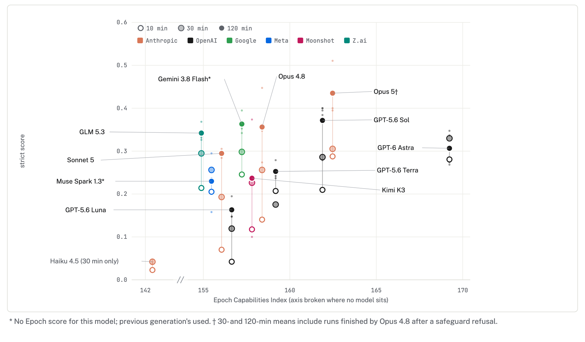
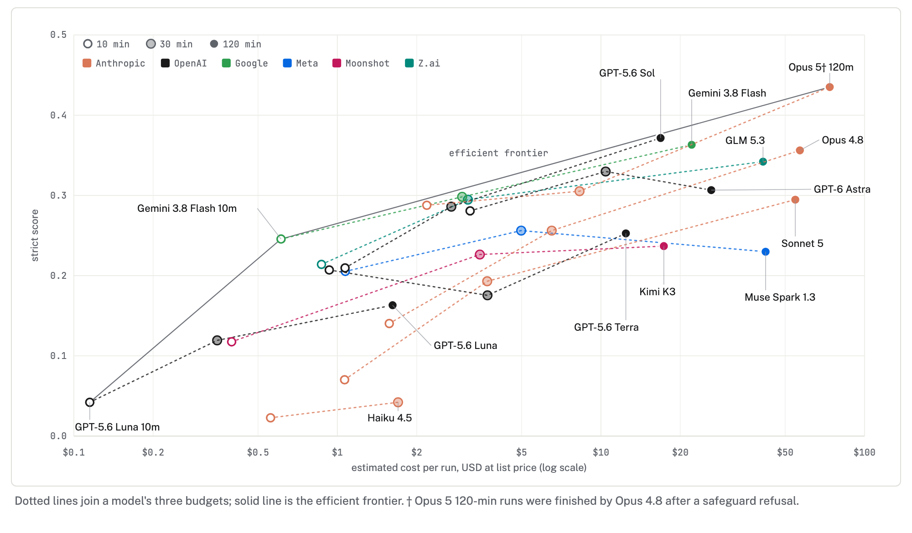

# Results

We ran twelve models at 10, 30 and 120 minutes, three runs per cell. Scores are the strict score: a finding counts only if the judge scored it above 0.5, so 0.37 means the report pinned down about 37% of the findings.

**Nobody is close to solving it.** The best two-hour means are GPT-5.6 Sol at 0.37, Gemini 3.8 Flash and Opus 4.8 at 0.36. The best single run scores 0.51. Opus 5 tops the table at 0.44, but all of its two-hour runs were finished by Opus 4.8 after a safeguard refusal (see below).

**Time helps a lot and the curves haven't flattened.** Sol goes 0.21 → 0.29 → 0.37 across the three budgets; Opus 4.8 goes 0.14 → 0.36. A budget step is worth about as much as the gap between adjacent models, so a ranking at one budget says little about another. Exceptions: GPT-6 Astra is flat after 30 minutes and Muse Spark drops.

**General capability barely predicts performance.** Astra has the highest Epoch Capabilities Index of any model we ran and finishes sixth. Gemini Flash and GLM 5.3, near the bottom of the index, match Opus 4.8. The correlation across all models comes almost entirely from Haiku 4.5, 13 index points below the field and scoring near zero.

Figure 1: strict score against Epoch Capabilities Index. Hollow to solid marks are 10, 30 and 120 minutes; small dots are individual runs.

**Cost per finding varies fivefold.** At two hours Sol scores 0.37 for about $17 and Gemini Flash 0.36 for $22; Opus 4.8 scores 0.36 for $57. Claude Code is expensive because it re-reads a very long context every turn. Only three points sit on the efficient frontier: Luna at 10 minutes, Gemini Flash at 10 minutes, and the Opus 5 fallback runs at two hours.

Figure 2: strict score against estimated cost per run at list prices, log scale. Subscription runs are priced as if paid per token.

**Safeguard refusals knocked Opus 5 out of the long runs.** It refused once, classed as cyber, in two of three 30-minute runs and all three two-hour runs, and Claude Code switched to Opus 4.8 for the rest of the session. Those runs averaged 0.44, the best in the set, so this is not a capability limit. But an agent-swarm log looks enough like an attack that the model most likely to do the job may decline it partway through.

**Small models get almost nothing.** Haiku 4.5 scores 0.02 to 0.04; Sonnet 5 scores 0.07 at ten minutes.

Caveats: three runs per cell separates the top from the bottom but not models a few points apart. Round 4 used a slightly different prompt at each budget. The judge is a Claude model; on round 3, Sol and Opus 5 as judges ranked reports almost identically.
