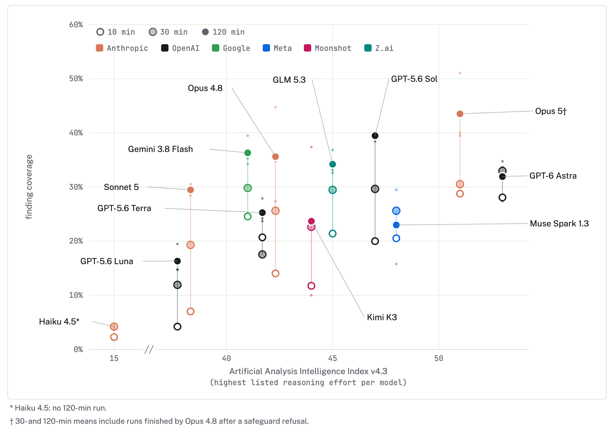

# Results (historical draft)

This working draft predates the combined metric and final run counts. It is
preserved as writing history, not the publication source. Use the current
`results_figures.md` and tracked combined-score data for results.

We ran twelve models at 10, 30 and 120 minutes, three runs per cell. Scores are finding coverage: a finding counts only if the judge scored it above 0.5, so 39% means the report pinned down about 39% of the findings.

**Nobody is close to solving it.** The best two-hour means are GPT-5.6 Sol at 39%, Gemini 3.8 Flash and Opus 4.8 at 36%. The best single run scores 51%. Opus 5 tops the table at 44%, but all of its two-hour runs were finished by Opus 4.8 after a safeguard refusal (see below).

**Time helps a lot and the curves haven't flattened.** Sol goes 20% → 30% → 39% across the three budgets; Opus 4.8 goes 14% → 36%. A budget step is worth about as much as the gap between adjacent models, so a ranking at one budget says little about another. Exceptions: GPT-6 Astra is flat after 30 minutes and Muse Spark drops.

**General capability barely predicts performance.** Astra has the highest Epoch Capabilities Index of any model we ran and finishes sixth. Gemini Flash and GLM 5.3, near the bottom of the index, match Opus 4.8. The correlation across all models comes almost entirely from Haiku 4.5, 13 index points below the field and scoring near zero.

Figure 1: finding coverage against Epoch Capabilities Index. Hollow to solid marks are 10, 30 and 120 minutes; small dots are individual runs.

The picture is the same on the Artificial Analysis Intelligence Index: Astra leads that index too and still finishes mid-table, while Gemini Flash and Opus 4.8, 11 points apart on the index, land at the same score.

Figure 2: the same columns placed by the Artificial Analysis Intelligence Index, each model's highest listed reasoning-effort setting.

**Cost per finding varies about fivefold.** At two hours Sol reaches 39% for about $10 and Gemini Flash 36% for $22; Opus 4.8 reaches 36% for $57. Claude Code is expensive because it re-reads a very long context every turn. Only four points sit on the efficient frontier: Luna and Gemini Flash at 10 minutes, Sol at two hours, and the Opus 5 fallback runs at two hours.

Figure 3: finding coverage against estimated cost per run at list prices, log scale. Subscription runs are priced as if paid per token.

**Safeguard refusals knocked Opus 5 out of the long runs.** It refused once, classed as cyber, in two of three 30-minute runs and all three two-hour runs, and Claude Code switched to Opus 4.8 for the rest of the session. Those runs averaged 44%, the best in the set, so this is not a capability limit. But an agent-swarm log looks enough like an attack that the model most likely to do the job may decline it partway through.

**The harness matters as much as the model for cost.** We ran GPT-5.6 Sol under two harnesses: Codex CLI, and a bare ReAct loop that keeps an append-only conversation so every turn re-reads everything before it. At two hours Codex CLI reached 39% coverage for about $10 per run; ReAct reached 34% for about $25. At ten minutes the gap was small (20% versus 22%), so the harness mostly matters once runs get long. Figures 1 to 3 use the Codex CLI runs for Sol and Astra.

**Small models get almost nothing.** Haiku 4.5 covers 2% to 4% of findings; Sonnet 5 covers 7% at ten minutes.

Caveats: three runs per cell separates the top from the bottom but not models a few points apart. Round 4 used a slightly different prompt at each budget. The judge is a Claude model; on round 3, Sol and Opus 5 as judges ranked reports almost identically.
