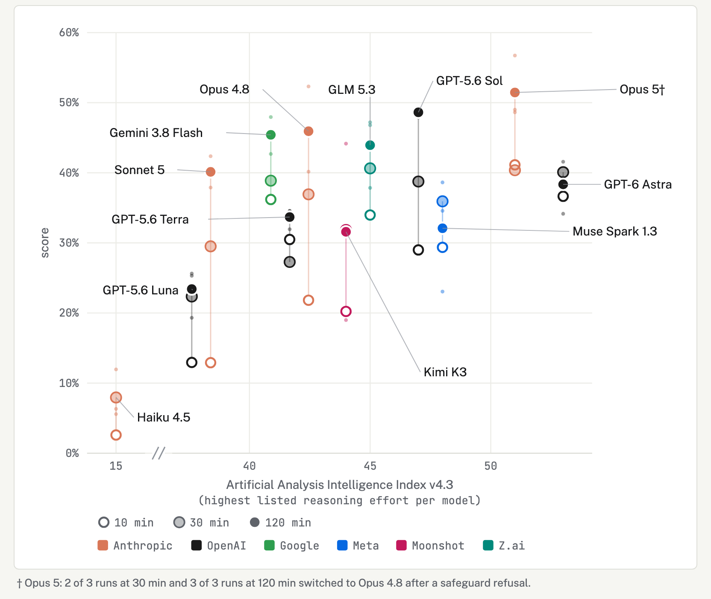
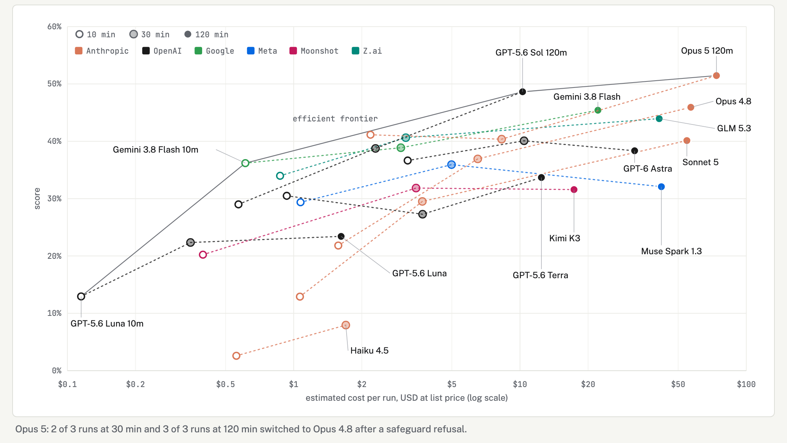
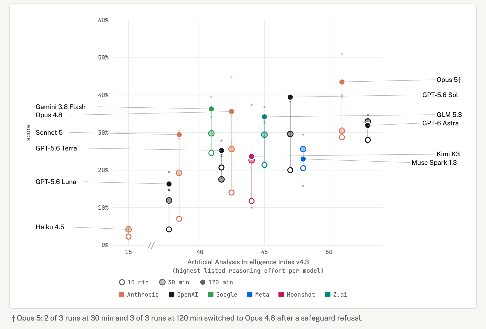
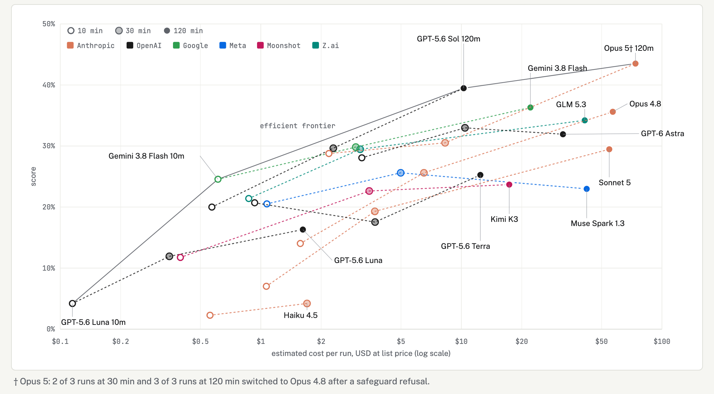
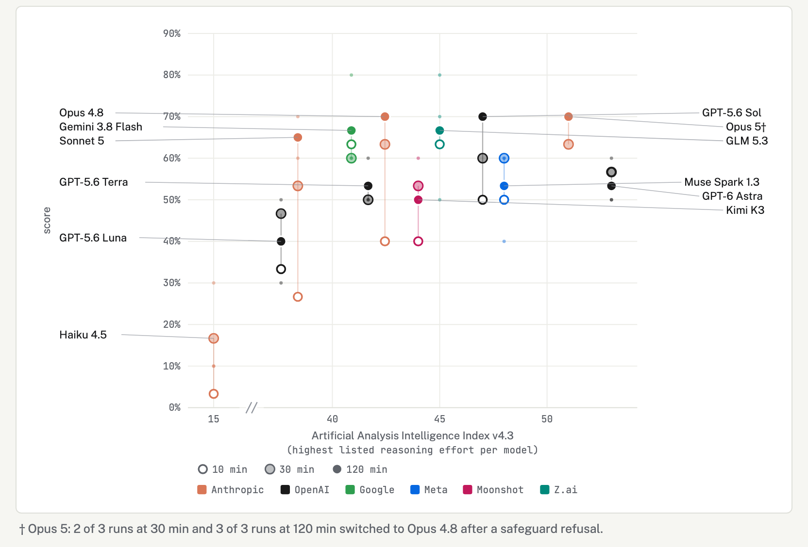
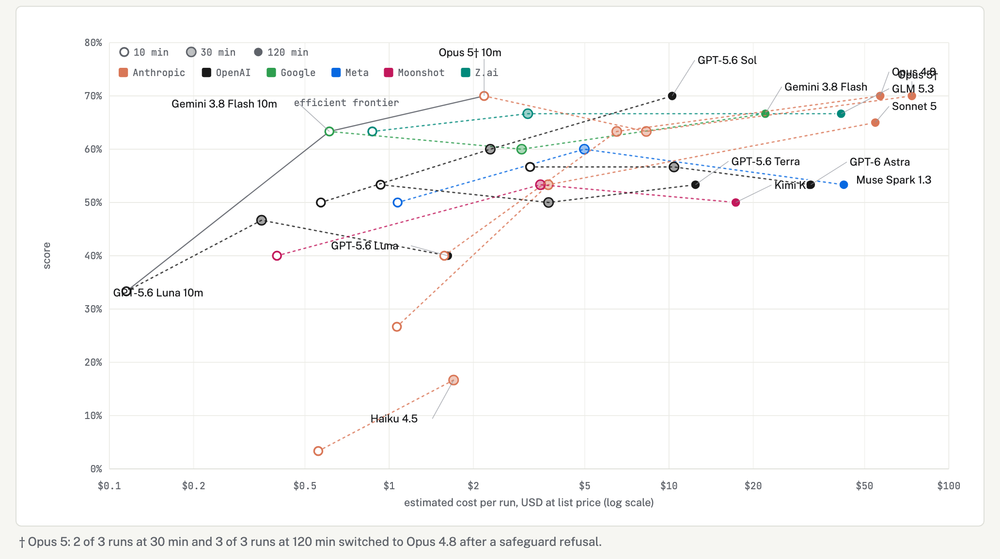

# Round 4 results figures

Built by `viewers/build_headline_figures.py` and rendered by `viewers/render_headline_pngs.py`; label positions come from `viewers/figures/headline_labels.json`. Combined score = 0.7 × finding coverage + 0.3 × holistic TL;DR score, both Fable 5.1's grades over the same round-4 reports.

Figure 1: Combined score (0.7 × finding coverage + 0.3 × holistic TL;DR score) against the Artificial Analysis Intelligence Index. Hollow to solid marks are 10, 30 and 120 minutes; small dots are individual runs behind the top mark.

Figure 2: Combined score against estimated cost per run at list prices, log scale. Dotted lines join a model's three budgets; the solid line is the efficient frontier. Subscription runs are priced as if paid per token.

Figure 3: Finding coverage alone (the strict v2 score) against the Artificial Analysis index.

Figure 4: Finding coverage alone against cost per run.

Figure 5: Holistic TL;DR score alone against the Artificial Analysis index.

Figure 6: Holistic TL;DR score alone against cost per run.
